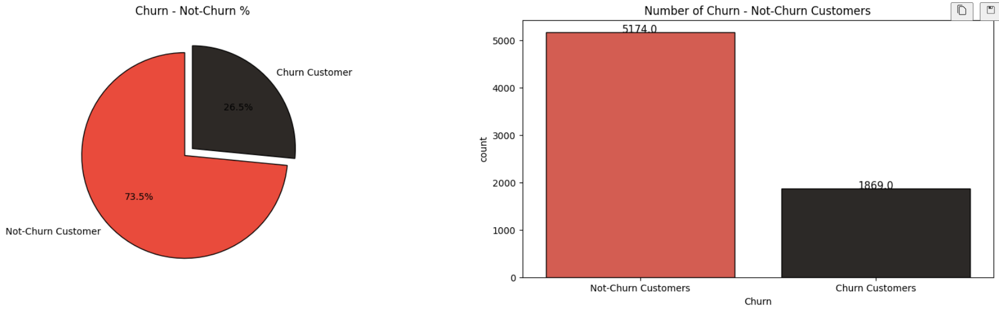
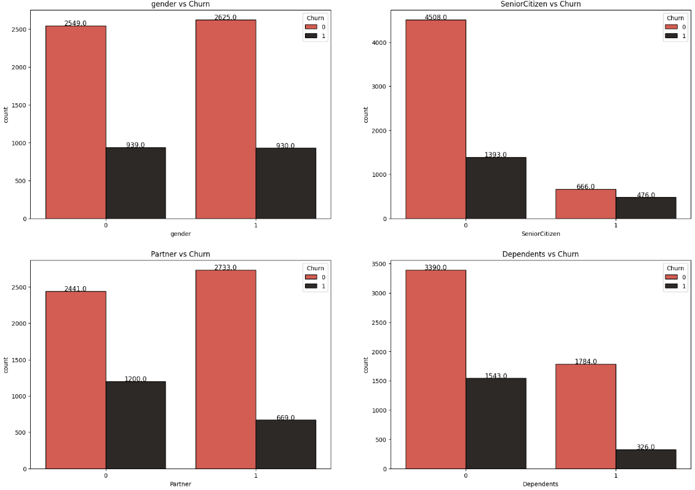
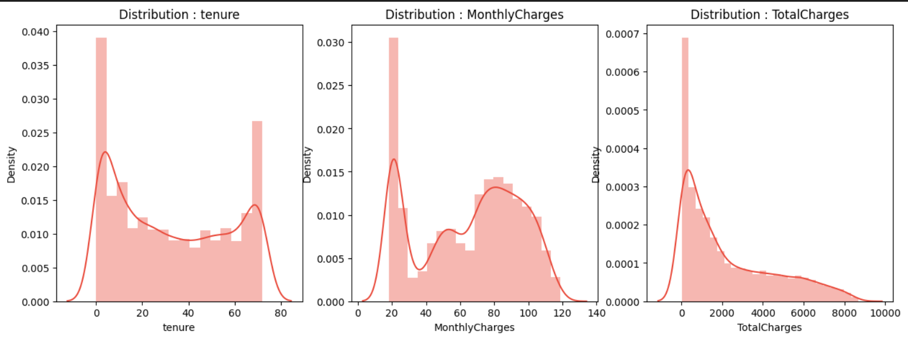
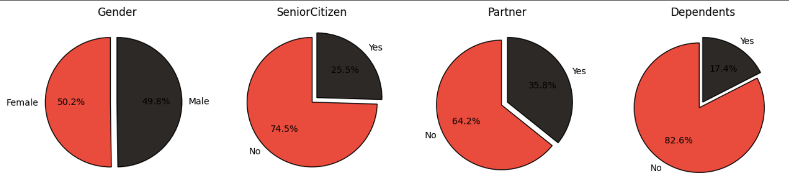
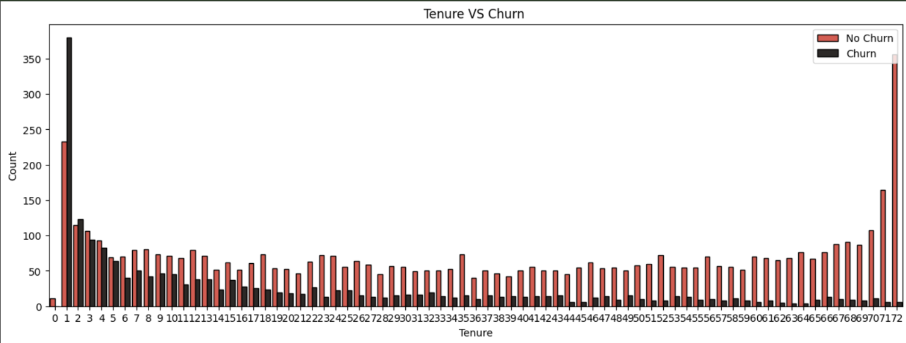
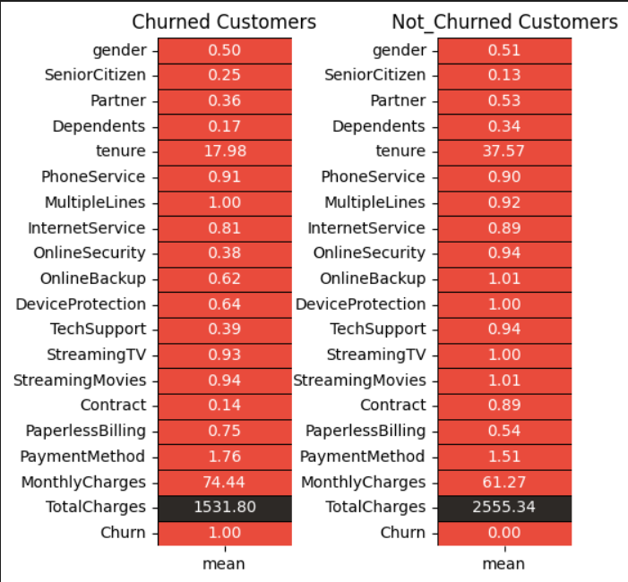
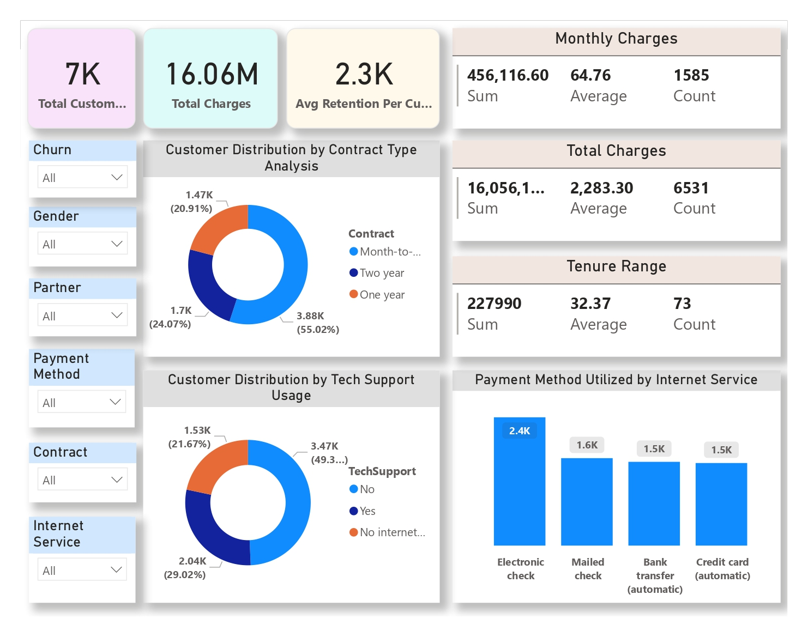
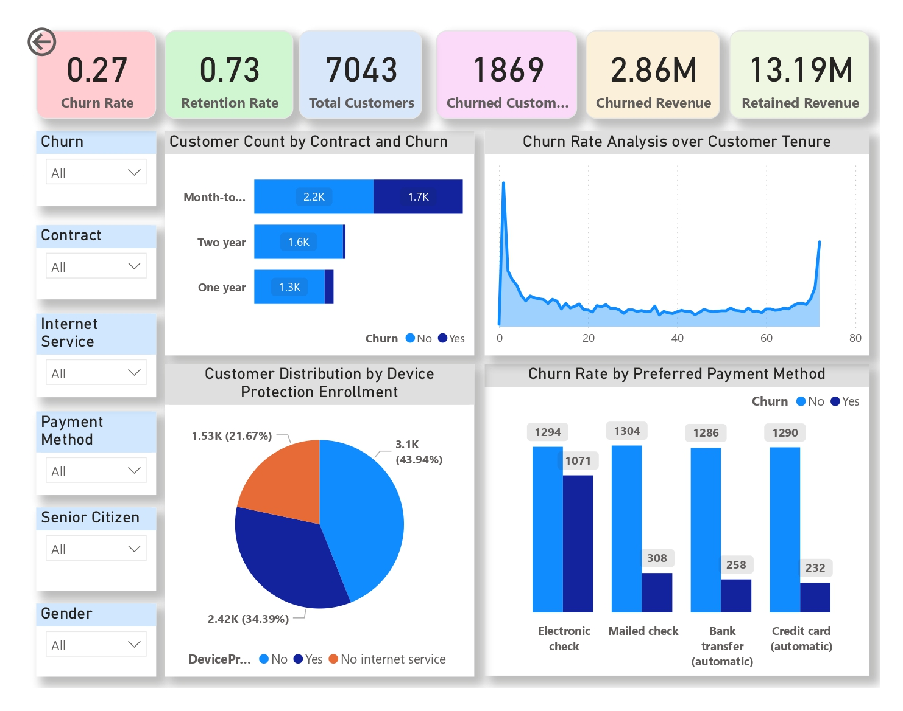
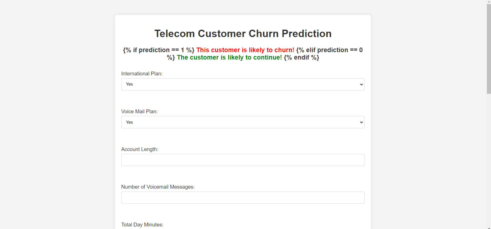
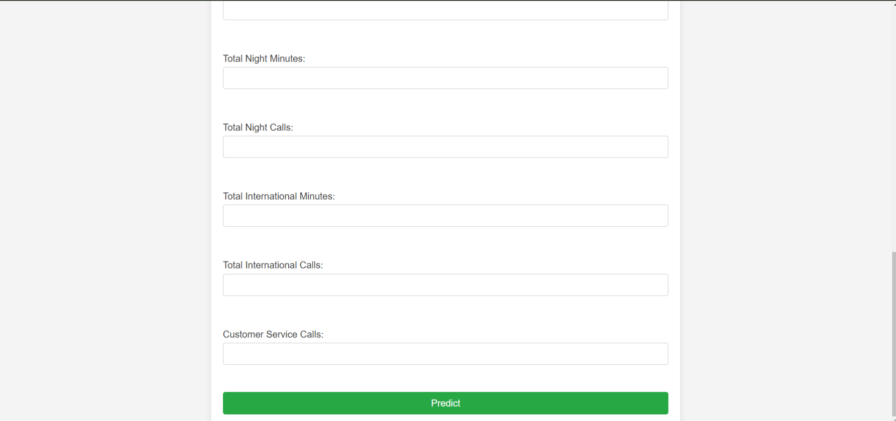

# Telecom Customer Retention Analytics And Strategy

## Overview

This repository contains a data science portfolio project focused on predicting customer churn in the telecommunications industry. The project demonstrates a machine learning workflow, including exploratory data analysis, data preprocessing, handling class imbalance, predictive modeling, and business intelligence reporting.

## Project Highlights

* Analyzed 7,043 telecom customer records.
* Conducted exploratory data analysis to identify churn drivers.
* Trained and evaluated multiple machine learning classification models.
* Achieved 85.70% accuracy using XGBoost.
* Built an interactive Power BI dashboard for business insights.
* Developed a Flask deployment prototype.

## Business Problem

Customer churn directly impacts revenue and profitability in the telecommunications industry. Acquiring a new customer is more expensive than retaining an existing one. This project aims to identify the behavioral and demographic factors that drive churn and to develop a predictive model that estimates the probability of customer attrition.

## Dataset Overview

The primary analysis is based on the IBM Telco Customer Churn dataset (`WA_Fn-UseC_-Telco-Customer-Churn.csv`).

* Total Records: 7,043
* Total Features Analyzed: 21
* Target Variable: Churn (Yes/No)

Key feature categories include:
* Customer Demographics: Gender, SeniorCitizen, Partner, Dependents
* Subscribed Services: PhoneService, InternetService, OnlineSecurity, TechSupport, StreamingTV
* Contract Information: Contract, PaperlessBilling, PaymentMethod
* Financial Metrics: MonthlyCharges, TotalCharges, Tenure

## Project Workflow

```text
Dataset
│
├── Data Cleaning
├── Exploratory Data Analysis
├── Data Preprocessing
├── Feature Selection
├── SMOTE
├── Model Training
├── Model Evaluation
├── Power BI Dashboard
└── Deployment Prototype
```
## Methodology

1. Data Cleaning and Preprocessing
   - Handled missing values and data inconsistencies.
   - Encoded categorical variables and scaled numerical features.

2. Exploratory Data Analysis
   - Analyzed churn patterns across demographics, services, contracts, and billing behavior.
   - Identified key factors associated with customer attrition.
     
3. Feature Selection
   - Applied statistical tests including Chi-Square and ANOVA.
   - Selected relevant predictors for modeling.

4. Predictive Modeling
   - Trained Logistic Regression, Decision Tree, Random Forest, and XGBoost models.
   - Addressed class imbalance using SMOTE.

5. Business Intelligence Reporting
   - Developed interactive Power BI dashboards for stakeholder insights.

## Exploratory Data Analysis

The project includes visual and statistical analysis to uncover patterns in customer behavior.

| Target Variable Distribution | Customer Demographics |
| --- | --- |
|  |  |

| Feature Distribution | Categorical Features |
| --- | --- |
|  |  |

| Tenure Analysis | Mean Tenure |
| --- | --- |
|  |  |

## Key Findings

* Month-to-month contract customers show the highest churn rate compared to one-year and two-year contract holders.
* Short-tenure customers are more likely to leave, indicating a need for early retention interventions.
* Customers without Online Security and Tech Support services exhibit higher churn probabilities.
* Higher monthly charges correlate with an increased likelihood of customer attrition.

## Machine Learning Approach

To predict churn, classification algorithms were trained and evaluated. The modeling pipeline included:
* Missing Value Imputation: Handled using mean imputation.
* Feature Selection: Categorical features were evaluated using Chi-Squared tests, and numerical features using ANOVA tests.
* Scaling: Applied MinMaxScaler to numerical fields (tenure, MonthlyCharges, TotalCharges).
* Handling Class Imbalance: The minority class was upsampled using Synthetic Minority Over-sampling Technique (SMOTE).

## Model Performance

| Model | Accuracy |
| --- | --- |
| Logistic Regression | 77.43% |
| Decision Tree | 79.46% |
| Random Forest | 81.01% |
| XGBoost Classifier | 85.70% |

### Best Model: XGBoost Classifier

| Metric                   | Score  |
| ------------------------ | ------ |
| Accuracy                 | 85.70% |
| ROC-AUC                  | 85.70% |
| F1 Score                 | 86.00% |
| Cross-Validation ROC-AUC | 93.84% |

## Project Outcomes

* Identified contract type, tenure, service subscriptions, and monthly charges as significant churn indicators.
* Achieved 85.70% classification accuracy using XGBoost.
* Developed an interactive dashboard for stakeholder reporting and churn monitoring.
* Demonstrated an end-to-end workflow covering data analysis, machine learning, visualization, and deployment concepts.

## Business Impact

By accurately identifying customers with a high probability of churning, this predictive modeling project supports retention strategies and revenue protection. 
* Business Decision Making: Dashboard insights allow stakeholders to monitor attrition trends, segment customers, and allocate resources to high-risk groups.
* Retention Campaigns: Understanding that short-tenure and month-to-month customers are at higher risk enables targeted promotional offers. Interventions such as discounting annual contracts or bundling critical services like Tech Support can measurably improve customer retention rates.

## Power BI Dashboard

An interactive dashboard was created to visualize key performance indicators and attrition drivers.

### Executive Overview


### Detailed Insights


## Deployment Prototype

The repository includes a Flask application (`app.py`) built as a deployment structure demonstration. 

Note: The current `app.py` script and the deployed model (`models/random_forest_model.pkl`) are configured for a different dataset (the SyriaTel Telecom Churn dataset), requiring features such as International Plan and Total Day Minutes. This prototype demonstrates the architecture for serving machine learning models via a web interface, but it is not currently integrated with the primary IBM Telco dataset analyzed in the Jupyter notebook.

| Input Form | Prediction Output |
| --- | --- |
|  |  |

## Tech Stack

Languages:
* Python

Libraries:
* Pandas
* NumPy
* Matplotlib
* Seaborn
* Scikit-Learn
* XGBoost
* Imbalanced-Learn

Tools:
* Jupyter Notebook
* Power BI
* Flask
* Git
* GitHub

## Repository Structure

```text
Telecom-Customer-Retention-Analytics/
│
├── assets/
├── data/
├── docs/
├── models/
├── notebook/
├── powerBI/
├── reports/
├── static/
├── templates/
├── app.py
├── requirements.txt
└── README.md
```

## Installation

1. Clone the repository
```bash
git clone https://github.com/Raunak1303/Telecom-Customer-Retention-Analytics-and-Strategy.git
cd Telecom-Customer-Retention-Analytics-and-Strategy
```

2. Install dependencies
```bash
pip install -r requirements.txt
```

3. Explore the Notebook
Navigate to the `notebook/` directory and open `telco_churn_prediction.ipynb` to view the data analysis and modeling process.

## Author

Raunak Raj Singh
